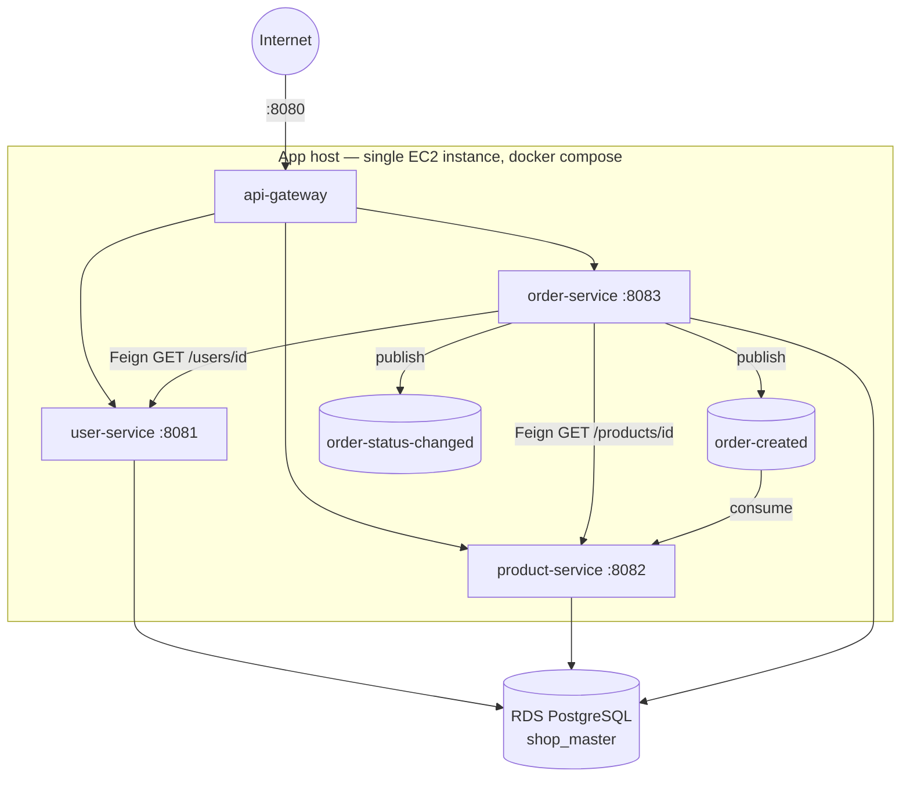
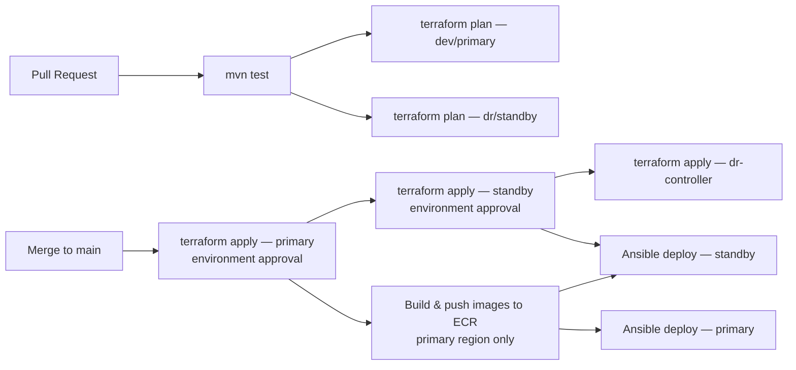

# Architecture

## 1. Components

| Component | Role |
|---|---|
| `api-gateway` | Spring Cloud Gateway. Single public entry point on port 8080; routes `/api/users/**`, `/api/products/**`, `/api/orders/**` to the three backend services and strips the prefix. |
| `user-service` | Owns user data. Called by the gateway and, synchronously via OpenFeign, by `order-service` to validate a user before creating an order. |
| `product-service` | Owns product/stock data. Called by the gateway and by `order-service` (Feign) for validation; also consumes `order-created` events asynchronously from SQS to decrement stock. |
| `order-service` | Owns order data. Validates the user and product via Feign before persisting an order, then publishes `order-created` / `order-status-changed` events to SQS. |
| PostgreSQL (`shop_master`, RDS) | Single shared database instance/schema used by all three data-owning services. |
| SQS (`order-created`, `order-status-changed`) | Asynchronous event transport between `order-service` (producer) and `product-service` (consumer). |

All four services are Java 21 / Spring Boot, built into Alpine-based Docker
images, and run together via `docker-compose` on the app host.

## 2. Deployment topology (per region)

One EC2 host runs all four containers. This keeps the (dev-scale) system
simple, but it is also the single biggest availability risk in the
non-DR path — see `docs/limitations.md`.

## 3. Networking design

- One VPC per region, `10.0.0.0/16`, spanning **two Availability Zones**.
- Three subnet tiers per AZ: **public** (app host + NAT gateway),
  **private-compute** (reserved for future internal services),
  **private-data** (RDS subnet group).
- A single NAT gateway gives the app host outbound internet access
  (package installs, ECR pulls) while RDS stays in private subnets with
  no route to the internet.
- The app host gets a stable **Elastic IP** (not just an ephemeral public
  IP) specifically because Route 53 health checks and failover records
  need a fixed target to poll and point at.
- Security groups are per-service and explicitly scoped: the gateway
  accepts `0.0.0.0/0` on 8080; each backend service only accepts traffic
  from the gateway's SG and (for `user`/`product`) from `order-service`'s
  SG on its own port; RDS only accepts 5432 from the three service SGs.
  See `docs/security.md` for the full rationale.

## 4. Event-driven components

`order-service` is the only SQS producer; `product-service` is the only
consumer of `order-created` (used to decrement stock after an order is
placed). `order-status-changed` is published but has no consumer yet —
reserved for a future notification/audit service (see
`docs/limitations.md`). Both queues are standard (at-least-once,
unordered) SQS queues, chosen over the project's original MSK/Kafka design
because Kafka needs a provisioned cluster that Free Tier accounts can't
run, whereas SQS is serverless and this system never needs Kafka's
multi-consumer-group fan-out (there is always exactly one consumer per
event type).

## 5. CI/CD workflow

- `ci.yml`: on every PR — Maven test suite, then `terraform plan` for
  both the `dev` and `dr` workspaces (OIDC auth, no long-lived keys).
- `deploy.yml`: on merge to `main` — `terraform apply` to primary (gated
  by a GitHub Environment approval), then standby (separate approval
  gate), then the `dr-controller` environment (Route 53 + Lambda), then
  builds/pushes the four images once (ECR replication mirrors them to
  the standby region automatically), then runs the Ansible playbook
  against both regions' inventories.
- `dr-drill.yml`: `workflow_dispatch` — stops the primary app host to
  simulate an outage, lets the existing Route 53 health check → alarm →
  Lambda chain fail over on its own, polls DNS until it resolves to the
  standby, and reports the measured RTO. See `docs/dr.md`.

## 6. Major technical decisions

| Decision | Why |
|---|---|
| SQS instead of MSK/Kafka | Free-Tier-compatible, serverless, matches the single-producer/single-consumer usage pattern. |
| Single EC2 host with docker-compose instead of ECS/EKS | Keeps the primary environment inside Free Tier; the DR layer compensates for the resulting single-instance risk at the *regional* level rather than the *process* level. |
| RDS Multi-AZ (primary) **and** cross-region read replica (standby) | Multi-AZ covers AZ-level failure with automatic, zero-RPO failover; the cross-region replica covers regional failure, which Multi-AZ cannot. |
| Pilot-light standby (EC2 stopped, DB replica always streaming) | The DB is the expensive-to-recreate, slow-to-warm part of the stack, so it stays live; compute is cheap and fast to start, so it stays off until needed. See `docs/dr.md` for the cost/RTO tradeoff. |
| Route 53 failover routing (no ALB/custom controller) | DNS-based failover needs no additional compute, and Route 53 health checks + a `PRIMARY`/`SECONDARY` record pair are enough to redirect client traffic without any manual console step. |
| A Lambda triggers only the DB promotion, not DNS failover | Route 53 already fails over DNS on its own; the one thing it *can't* do is call `rds:PromoteReadReplica`, so the Lambda's scope is deliberately minimal. |
| SSM Parameter Store, fetched on-host by Ansible | Keeps DB credentials out of any file that touches the CI runner's disk or git history; the app host's own IAM role is the only thing that can read them. |
| Three separate Terraform root environments (`dev`, `dr`, `dr-controller`) instead of one | Avoids a state/module dependency cycle: the controller needs outputs from *both* regions, so it can't live inside either one. |

## 7. Service communication summary

| Caller | Callee | Protocol | Purpose |
|---|---|---|---|
| Client | api-gateway | HTTP :8080 | All external entry |
| api-gateway | user/product/order-service | HTTP (internal DNS via docker-compose service name) | Reverse proxy |
| order-service | user-service | HTTP (Feign) | Validate user exists before creating order |
| order-service | product-service | HTTP (Feign) | Validate product exists/has stock before creating order |
| order-service | SQS | AWS SDK | Publish `order-created`, `order-status-changed` |
| product-service | SQS | AWS SDK (poller) | Consume `order-created`, decrement stock |
| user/product/order-service | RDS | JDBC | Persistence (shared `shop_master` DB, default schema) |
