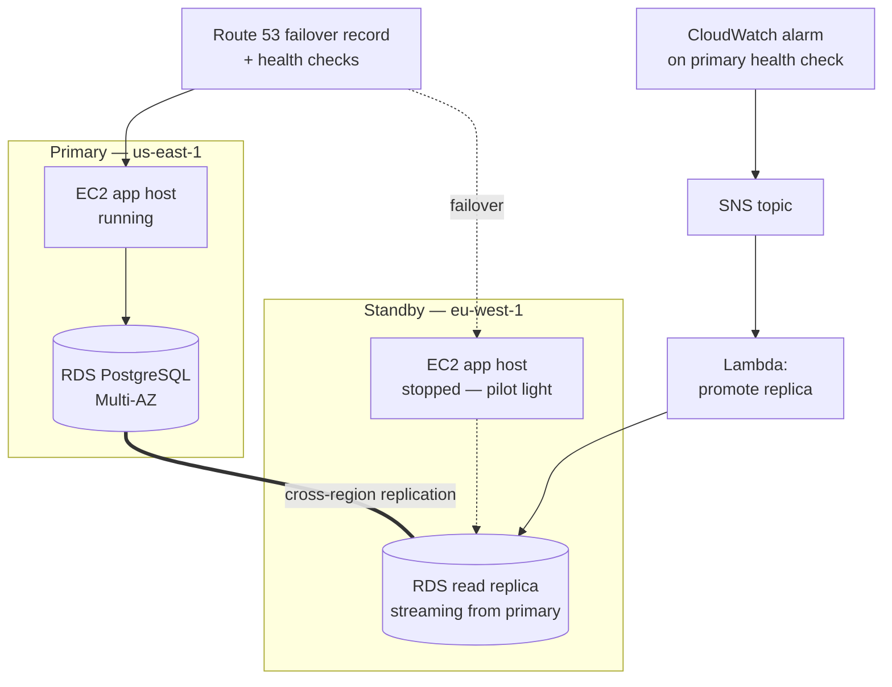
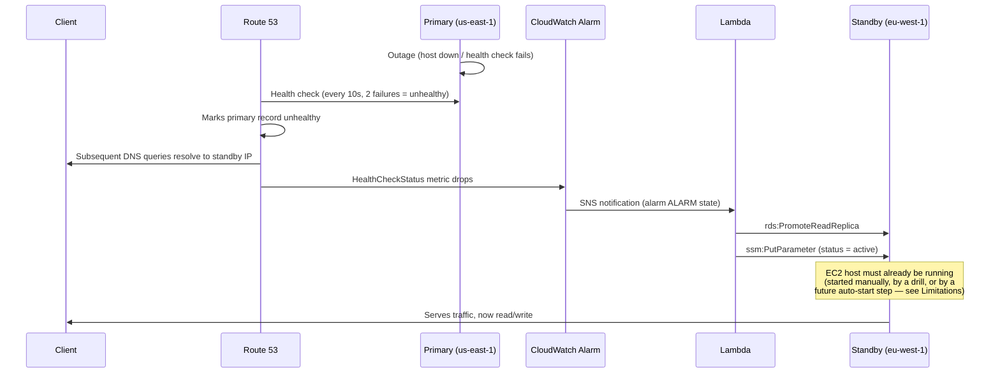

# Disaster Recovery Runbook

## Architecture recap



## Failover sequence (what happens when the primary becomes unavailable)



Note the division of responsibility: **Route 53 handles DNS failover
entirely on its own** (no Lambda involvement) via its native
`PRIMARY`/`SECONDARY` failover routing policy and per-record health
checks. The Lambda's only job is the one thing DNS can't do: promote the
read replica so the standby can accept writes.

## Target RTO / RPO

| Metric | Target | Justification |
|---|---|---|
| **RPO** | ≤ 5 minutes | RDS cross-region read replicas typically replicate within seconds to a few minutes under normal load; this is not a synchronous commit, so some in-flight transactions can be lost in a hard regional failure. 5 minutes is a conservative target given the app's write volume in this project's scale. |
| **RTO** | ≤ 10 minutes | Dominated by two serial steps: (1) Route 53 detection, ~20-30s (2 failed 10s-interval checks) plus DNS TTL of 30s, and (2) EC2 cold start + docker compose pull/`--wait` health checks, which can take several minutes on a t3.micro under `start_period: 900s` in the compose healthchecks. RDS promotion itself is typically under a minute. 10 minutes budgets comfortably for all three with margin. |

## How to trigger a failover drill

Via GitHub Actions (recommended — this is what's demonstrated live):

1. Go to **Actions → DR Failover Drill → Run workflow**.
2. Enter `drill` in the confirmation input and run it.
3. The workflow:
   - Stops the primary EC2 instance (simulates the outage — no console
     click, just `aws ec2 stop-instances` from the pipeline).
   - Polls the public DNS name every 15s until it resolves to the
     standby's IP.
   - Publishes the measured RTO to the workflow's job summary.
   - Restarts the primary instance (rollback of the *simulated outage*
     itself — see the important caveat below).

Manually (equivalent steps, e.g. from a workstation):

```bash
# 1. Note the start time.
date +%s

# 2. Simulate the outage.
aws ec2 stop-instances --instance-ids $(terraform -chdir=terraform/environments/dev output -raw ec2_instance_id)

# 3. Watch it happen.
watch -n5 "dig +short $(terraform -chdir=terraform/environments/dr-controller output -raw failover_dns_name)"
# ... or fetch it directly:
aws route53 get-health-check-status --health-check-id $(terraform -chdir=terraform/environments/dr-controller output -raw primary_health_check_id 2>/dev/null)

# 4. Once it resolves to the standby IP, note the end time and subtract.
```

## How to roll back a failover

Rolling back is **not** symmetric with failing over, because promoting a
read replica is a one-way operation — a promoted RDS instance cannot be
turned back into a replica of its former source. Rollback therefore
means *re-establishing* the original topology, not simply reversing a
flag:

1. **Restart the primary EC2 host** (the drill workflow does this
   automatically): `aws ec2 start-instances --instance-ids <primary-id>`.
2. **Decide the new topology direction.** After a real failover, the
   standby region is now the writable side. Two options:
   - **Fail back** to the original primary once it's confirmed healthy:
     create a *new* cross-region read replica of the (now-promoted)
     `eu-west-1` instance back in `us-east-1`, let it catch up, then
     promote *that* one and flip DNS/roles back. This is the safer,
     zero-data-loss path but takes as long as the original replica took
     to build.
   - **Stay failed over** and rebuild `us-east-1` as the new standby:
     point the `dr` Terraform environment's `source_db_arn` at the
     promoted `eu-west-1` instance and re-apply with regions swapped.
3. **Reset the standby status parameter** (`/shop/dr/status`) back to
   `"standby"` once the new replica direction is established, so the
   next drill starts from a clean state.
4. Re-run `terraform plan` in all three environments afterward to
   confirm no drift was introduced by the manual promotion (the
   `aws_ec2_instance_state`/RDS resources may show as needing an update
   to match whichever direction you chose in step 2).

This manual re-seeding step is the main piece of the DR story that is
**not** yet automated — see `docs/limitations.md`.

## Cost-awareness: pilot-light vs. warm-standby

This project defaults to **pilot-light**: the standby RDS replica is
always running and streaming (this is what bounds the RPO), but the
standby EC2 host is kept **stopped** (`instance_state = "stopped"` on
`aws_ec2_instance_state`) between drills, so it costs nothing beyond its
30 GB gp3 root volume and the (idle) replica itself.

The tradeoff: a stopped EC2 instance adds its full boot + Docker image
pull + Spring Boot startup time (potentially several minutes on a
t3.micro) to the RTO. Setting `standby_instance_state = "running"` in
`terraform/environments/dr/variables.tf` switches to a **warm-standby**
pattern — the host stays up and could, with a small addition, run the
containers permanently against the read-only replica — trading a
roughly 2x increase in standby-region compute cost for a faster RTO.
This is a one-line variable change; it isn't the default because the
assignment's constraint set explicitly asks for a cost-aware pattern
with the tradeoff explained, and pilot-light is the cheaper of the two
valid choices here.
